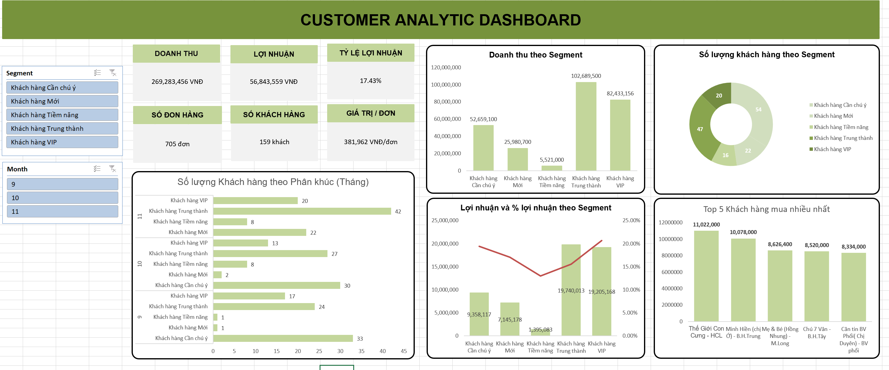
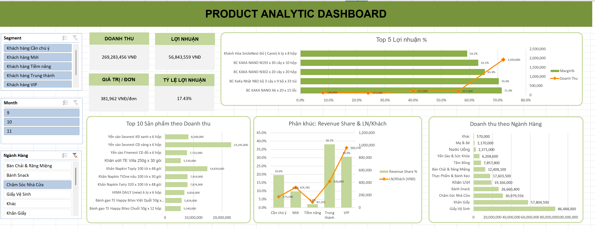

# 🔮 Customer Churn Prediction Pipeline & Enterprise Data Warehouse

> **End-to-End Machine Learning & Data Engineering System** – Dự báo khách hàng rời bỏ cho doanh nghiệp bán lẻ thực tế

[](https://python.org)
[](https://scikit-learn.org)
[](https://xgboost.readthedocs.io)
[](#)
[](#)

---

## 📌 Tổng Quan Dự Án

Dự án xây dựng một **hệ sinh thái Dữ liệu hoàn chỉnh** bao gồm 2 phần chính:
1. **Data Warehouse (SQL Server):** Lưu trữ tập trung, tự động hóa luồng ETL/ELT, xây dựng Feature Store trực tiếp trong Database.
2. **Machine Learning Pipeline (Python):** Dự báo khách hàng có nguy cơ rời bỏ (churn) trong tháng tới, phục vụ trực tiếp cho hoạt động vận hành sales.

Toàn bộ quy trình được thiết kế theo tiêu chuẩn **production-ready**: từ làm sạch dữ liệu thực tế từ file Excel nghiệp vụ, xây dựng Data Warehouse chuẩn Star Schema, model backtest nghiêm ngặt theo time-split, đến xuất danh sách phân tầng rủi ro và đẩy ngược lại Database (Reverse ETL) cho đội sales.

---

## 📊 Dashboard Kinh Doanh (BI)

### Customer Analytic Dashboard (Excel)



**Nội dung dashboard:**
- 📦 KPIs: **Doanh thu · Lợi nhuận · Tỷ lệ lợi nhuận · Số đơn hàng · Số khách hàng · Giá trị đơn**
- 📈 Doanh thu & Lợi nhuận theo Segment khách hàng (VIP / Trung thành / Tiềm năng / Mới / Cần chú ý)
- 🍩 Phân bổ số lượng khách hàng theo phân khúc
- 📊 Số lượng khách hàng theo tháng – theo dõi xu hướng theo phân khúc
- 🏆 Top 5 khách hàng mua nhiều nhất

### Product Analytic Dashboard (Excel)



**Nội dung dashboard:**
- 💰 KPIs: Doanh thu · Lợi nhuận · Giá trị đơn · Tỷ lệ lợi nhuận
- 📈 Top 5 sản phẩm theo **Tỷ lệ Lợi nhuận %** (Bar + Line combo)
- 📊 Top 10 sản phẩm theo Doanh thu
- 🔵 Revenue Share & LN/Khách theo phân khúc
- 🏢 Doanh thu theo **Ngành Hàng** (12 nhóm sản phẩm)

---

## 📁 Cấu Trúc Project

| File / Folder | Vai trò |
|---|---|
| `churn_pipeline_main.py` | Pipeline ML: load data, build feature, benchmark model, forecast, export Excel |
| `data/ver1.xlsx` | Workbook nguồn và dashboard Excel |
| `Clean_data.py` | Script làm sạch/tái dựng workbook Excel khi cần |
| `outputs/` | Chứa các file kết quả: Danh sách Churn vận hành, Báo cáo benchmark, Confusion Matrix |
| `requirements.txt` | Dependency cần cài để chạy pipeline Python |
| `docs/DATA_WAREHOUSE_ARCHITECTURE.md` | Tài liệu thiết kế chi tiết kiến trúc Enterprise DW & MLOps |
| `dw/DW_Master_Script_Full.sql` | DDL/SP SQL Server Master Script |
| `dw/load_excel_to_sql.py` | Script nạp `data/ver1.xlsx` vào Staging (ELT Ingestion) |
| `dw/load_scores_to_sql.py` | Script đẩy kết quả AI từ `outputs` vào Database (Reverse ETL) |

---

## 🧠 Machine Learning Methodology

### Feature Engineering
Pipeline tạo feature theo cửa sổ lookback 90 ngày tại từng snapshot:
- `Recency`, `Frequency`, `AOV`, `Margin`, `PromoRate`, `Trend`, `ActiveMonths`, `DaysSinceFirst`

### Backtest và Chọn Model
Do dữ liệu hiện chỉ có 3 tháng, pipeline dùng một holdout theo thời gian (Time-Split) thay vì Random Split để tránh Data Leakage:
- Train: snapshot 2023-09-30, label theo tháng 10
- Test: snapshot 2023-10-31, label theo tháng 11
- Forecast: snapshot 2023-11-30, dự báo rủi ro churn tháng 12

Kết quả benchmark trên tập Test Tháng 11:

| Model | ROC AUC | Average Precision | Precision | Recall | F2 | TN | FP | FN | TP |
|---|---:|---:|---:|---:|---:|---:|---:|---:|---:|
| **Random Forest calibrated** | **0.9304** | **0.9595** | 0.9455 | 0.7761 | 0.8050 | 46 | 3 | 15 | 52 |
| XGBoost | 0.9240 | 0.9435 | 0.9434 | 0.7463 | 0.7788 | 46 | 3 | 17 | 50 |
| Logistic Regression | 0.7999 | 0.7577 | 0.8158 | 0.9254 | 0.9012 | 35 | 14 | 5 | 62 |

*Random Forest calibrated được chọn làm Model Production nhờ mức Precision/AUC cao nhất với Threshold tối ưu F2.*

---

## 🚀 Hướng Dẫn Chạy & Vận Hành (Runbook)

### 1. Cài đặt môi trường Python
```bash
pip install -r requirements.txt
```

### 2. Xây dựng Data Warehouse (SQL Server)
Mở SQL Server Management Studio (SSMS) hoặc chạy lệnh sau qua `sqlcmd` để tự động khởi tạo Database và toàn bộ bảng/SP:
```bash
sqlcmd -S . -E -C -f 65001 -i dw/DW_Master_Script_Full.sql
```

Tiếp theo, cấu hình chuỗi kết nối và chạy nạp dữ liệu từ Excel lên Data Warehouse (Tự động chạy ELT build Star Schema & Feature Store):
```bash
set CHURN_DW_CONN_STR=Driver={ODBC Driver 18 for SQL Server};Server=localhost;Database=ChurnDW;Trusted_Connection=yes;TrustServerCertificate=yes;
set CHURN_DW_RUN_ETL=1
python dw/load_excel_to_sql.py
```

### 3. Huấn luyện Mô hình & Dự báo (ML Pipeline)
Chạy script ML chính để sinh ra danh sách dự báo rủi ro tháng tới:
```bash
python churn_pipeline_main.py
```

### 4. Đưa trí tuệ AI về Database (Reverse ETL & Action Rules)
Đẩy file dự báo ngược lại SQL Server để lưu trữ lịch sử chấm điểm, đồng thời Database sẽ tự kích hoạt Business Rules gán nhãn hành động (Gọi ngay, Zalo Offer...):
```bash
set CHURN_DW_APPLY_SCORE=1
python dw/load_scores_to_sql.py
```

Sau bước này, Data Warehouse đã có sẵn dữ liệu toàn diện tại bảng `dw.FactChurnScore`. Bạn có thể dùng Power BI cắm thẳng vào SQL Server để báo cáo!

---
*Dự án thực tế — Dữ liệu bán lẻ 2023 · Built with Python, scikit-learn & SQL Server*
